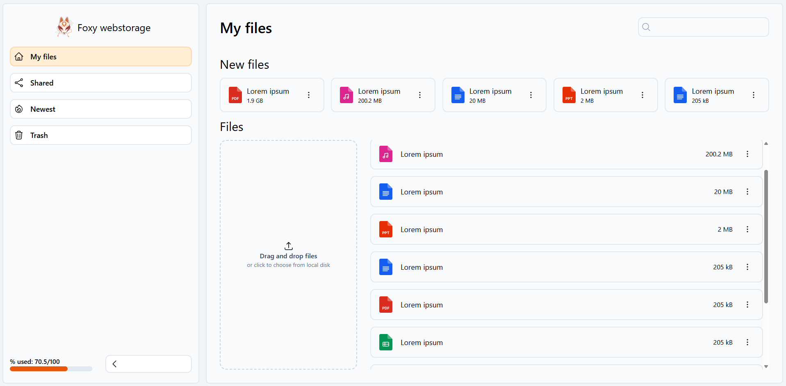

# Foxy webstorage

## AI disclaimer

AI to human written code ratio is around 10/90. I've used AI to help me with problems that I got stuck on or explain something if I didn't understand "What", "Why", "When".

I've tried and will keep trying to keep it as much of a handcrafted spaghetti as possible :)

## App overwiev

`Foxy webstorage` is a selfhost-oriented project that lets you:

- store files,
- access/preview files,
- manage files
- share files to the outside world via a direct link (with passkey already in the URL or by prompting the person opening for a passkey).

### Storing files:

TBD

### Accessing/previewing files:

TBD

### Managing files

TBD

### Sharing files

TBD

## Selfhosting guide

TBD

## Technologies used

- Typescript
- Next.js

## Opensource?

This project is free to use for everyone, if you want you can do whatever you want with it. Only thing I'd love you to do is to credit me, as the creator of the base.
